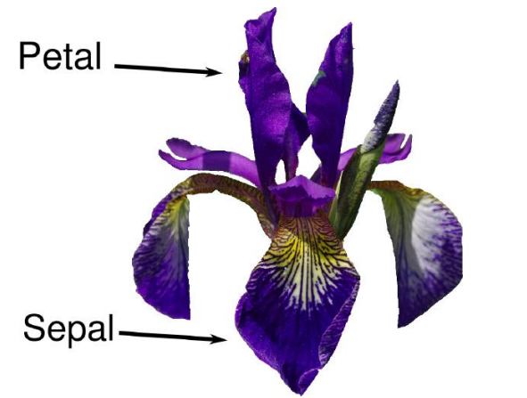

# Classifying_Iris_Species by k-Nearest Neighbors

This is a repository for classfying iris flower to four classes namely setosa, veriscolor, or virginica. The dataset has the measurements of some irises that have been previously identified by an expert botanist.

I built a machine learning model that can learn from the measurements of theses irises whose species is known, so that I can predict the species for a new iris.

I use the dataset from sklearn and the algorithm too. The dataset contains the measurments associated with each iris: the length and width of the petals and the length and width of the sepals, all measured in centimeters.

### The iris flower looks as follow

    

In the dataset there are 150 different flowers. I splitted the data in two parts one part of the data(which is 75%) is to build our machine learning model. The rest of the data(which is 25%) is used to asses hwo well the model works.

## Overall the model is about 97.37% accurate
